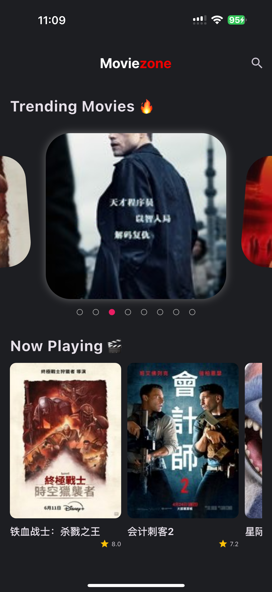
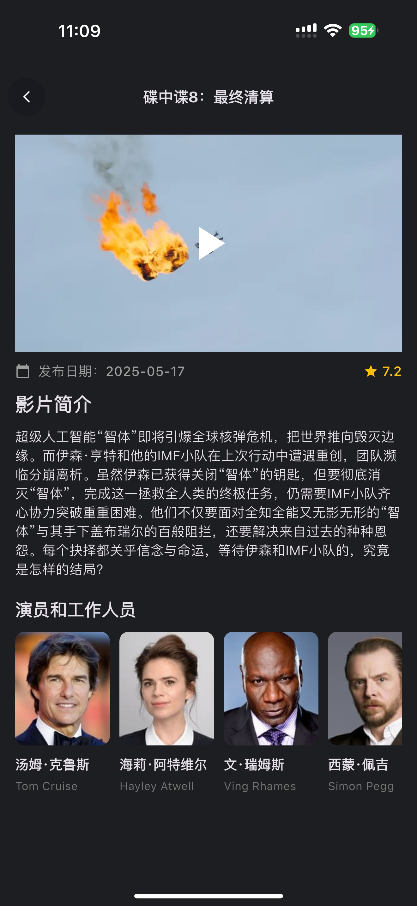
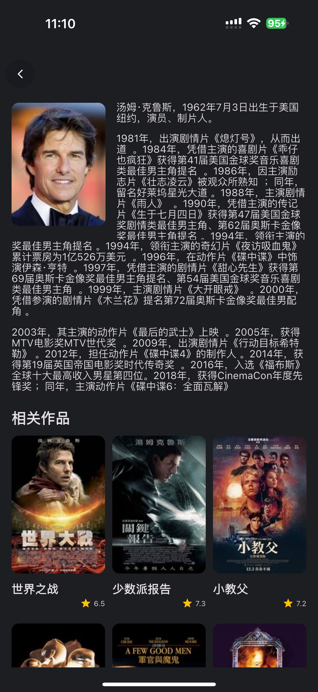

# Netflix Clone

一个使用Flutter开发的电影应用。使用themoviedb API获取电影数据，国内使用需要自行连接themoviedb。

## 📱 应用截图

<table>
  <tr>
    <td></td>
    <td></td>
    <td></td>
  </tr>
  <tr>
    <td align="center">主页界面</td>
    <td align="center">电影详情</td>
    <td align="center">工作人员详情</td>
  </tr>
</table>

## ✨ 核心特性

- 🎬 **电影浏览** - 精美的电影列表展示
- 📱 **响应式设计** - 适配不同屏幕尺寸
- 🎥 **视频播放** - 集成YouTube播放器
- 💾 **离线缓存** - 图片缓存优化

## 🛠 技术栈

### 核心框架
- **Flutter** - 跨平台移动应用开发框架
- **Dart** - 编程语言

### 状态管理
- **flutter_bloc** - BLoC状态管理模式
- **dartz** - 函数式编程支持

### 网络请求
- **dio** - HTTP客户端
- **connectivity_plus** - 网络连接检测

### UI组件
- **flutter_svg** - SVG图标支持
- **fan_carousel_image_slider** - 轮播图组件
- **cached_network_image** - 网络图片缓存

### 视频播放
- **youtube_player_flutter** - YouTube视频播放

### 本地存储
- **shared_preferences** - 轻量级数据存储
- **get_it** - 依赖注入

### 开发工具
- **logger** - 日志管理
- **permission_handler** - 权限管理

## 🏗 项目架构

项目采用Clean Architecture架构模式，确保代码的可维护性和可扩展性：

```
lib/
├── core/           # 核心功能模块
├── common/         # 通用组件和工具
├── data/           # 数据层
├── domain/         # 业务逻辑层
├── presentation/   # 表现层
└── main.dart       # 应用入口
```

### 架构特点
- **分层架构** - 清晰的代码分层，易于维护
- **依赖注入** - 使用get_it进行依赖管理
- **BLoC模式** - 响应式状态管理
- **Repository模式** - 数据访问抽象


## 📞 联系方式

- 作者: [SIMON Y]
- Email: simonyang81@gmail.com
- 项目链接: [https://github.com/simonyang81/netflix](https://github.com/simonyang81/netflix)

## 🙏 致谢

- [Flutter](https://flutter.dev/) - 出色的跨平台框架
- [BLoC](https://bloclibrary.dev/) - 强大的状态管理库
- [Netflix](https://www.netflix.com/) - UI设计灵感来源

---

⭐ 如果这个项目对你有帮助，请给它一个star！
